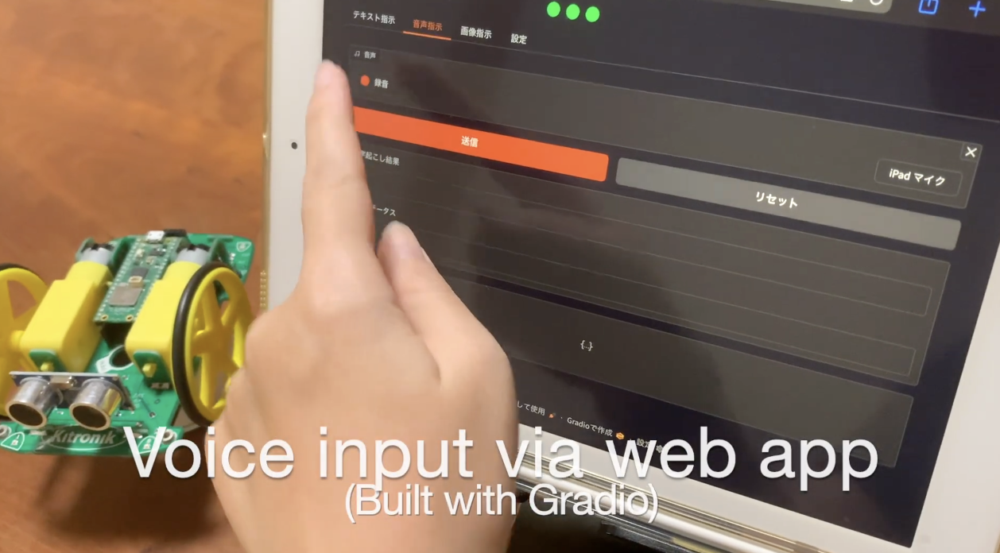
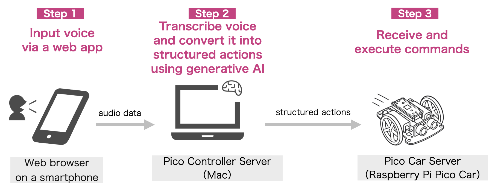
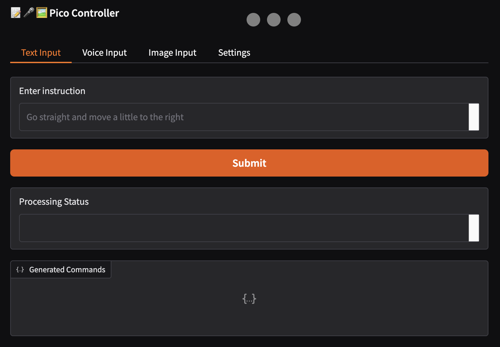
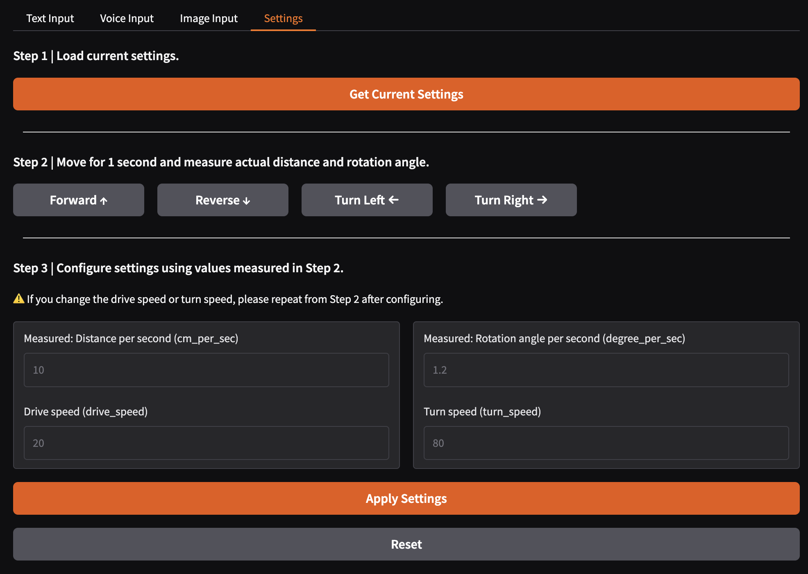

# LLM Pico Car

A demo project that controls a Raspberry Pi Pico car using voice, image, and text input.
Instructions entered via a Gradio UI are interpreted by an LLM and sent as movement commands to the car.

## Demo Video

- Demo Video (YouTube): https://www.youtube.com/watch?v=1UT2Sbvug0I

<a href="https://www.youtube.com/watch?v=1UT2Sbvug0I">
  
</a>

## Presentations

List of conference presentations about this project.

| Date | Event | Format | Title | Abstract | Slides | Video |
|------|-------|--------|-------|----------|--------|-------|
| 2026/1 | [PythonAsia Online Charity Talk H2](https://events.pythonasia.org/charity-talks-h2-2025/page/about/) | Talk(30min) | LLM Pico Car: How I Built a Voice-Controlled Toy Car Using Generative AI, Gradio, and Raspberry Pi Pico | - | [Slides](https://speakerdeck.com/komofr/python-asia-online-charity-talk-h2-llm-pico-car)(EN) | [Video](https://www.youtube.com/live/OXUJhvl2m7A?si=hh4R3fKawguU1EqA&t=4560)(1:16:00-) (EN) |
| 2025/12 | [PyLadiesCon 2025](https://2025.conference.pyladies.com/en/) | Talk(15min) | "Go Straight, Then Turn Right!": How I Built a Voice-Controlled Toy Car Using Generative AI, Gradio, and Raspberry Pi Pico | [Abstract](https://2025.conference.pyladies.com/en/session/go-straight-then-turn-right-how-i-built-a-voice-controlled-toy-car-using-generative-ai-gradio-and-raspberry-pi-pico/) | [Slides](https://speakerdeck.com/komofr/pyladiescon2025-llmpicocar)(JP / EN) | [Video](https://www.youtube.com/watch?v=EJajIBGRfD0) (JP / EN subs) |
| 2025/09 | [PyCon JP 2025](https://2025.pycon.jp/ja) | Poster | 「まっすぐ行って、右!」って言ってラズパイカーを動かしたい 〜生成AI × Raspberry Pi Pico × Gradioの試作メモ〜 | [Abstract](https://2025.pycon.jp/ja/timetable/talk/9CD3UW) | [Slides](https://speakerdeck.com/komofr/pyconjp2025-poster)(JP) | - |

## System Architecture



1. **Gradio Web App:** Users provide input via voice or route images through a web interface.
2. **Pico Controller Server (PC):** Interprets user input (voice or images) using LangChain, converts it into movement commands such as “move forward” or “turn right,” and sends them to the Pico Car Server.
3. **Pico Car Server (Raspberry Pi Pico):** Runs an HTTP server using Microdot, receives commands over Wi-Fi, and controls the Pico car accordingly.
    - Hardware: Commercial Pico car kit + Raspberry Pi Pico WH
        - Car kit: [Kitronik Autonomous Robotics Platform (Buggy) for Pico](https://kitronik.co.uk/products/5335-autonomous-robotics-platform-for-pico)

## Components

This project is composed of two servers.


| Server | Runtime Environment | Role | Code |
|--------|---------------------|------|------|
| **💻 Pico Controller Server** | PC (Python 3.13) | Receives user input via the Gradio UI and sends commands to the Pico Car Server | Located in the `pico_controller` directory |
| **🚜 Pico Car Server** | Raspberry Pi Pico WH (MicroPython)<br>Can also run on a PC using CPython in Mock mode | Receives commands and controls the car | Located in the `pico` directory |

In Mock mode, both servers can run on a PC.

## How to Run

**Note:** Error handling and overall stability are still a work in progress.

### 1. Running in Mock Mode (without hardware)

**Setup:**
Follow the "💻 Pico Controller Server Setup" instructions in [Setup Guide](./docs/en/setup.md).

**Note:** In Mock mode, both the Pico Car Server and the Pico Controller Server run in the same environment.

**Startup Steps:**
1. Start the Pico Car Server with the following command:
```bash
python pico/main.py --mock
```

Output:
```
mock mode: True
✅ initialize_settings
```

2. Start the Pico Controller Server with the following command:

```bash
python pico_controller/app.py --mock
```

Output:
```
Loading Whisper model...
[config]
USE_MOCK=True
BASE_URL=http://localhost:5001/
* Running on local URL:  {local URL}
* Running on public URL: {public URL}

This share link expires in 1 week. For free permanent hosting and GPU upgrades, run `gradio deploy` from the terminal in the working directory to deploy to Hugging Face Spaces (https://huggingface.co/spaces)
```

3. Open `{local URL}` or `{public URL}` in your browser to see the interface.
**Note:** To use voice input, you need to open the public URL.



### 2. Running on Real Hardware

**Required Hardware:**
- Kitronik Pico Buggy Kit (1 unit)
    - [Kitronik Autonomous Robotics Platform (Buggy) for Pico](https://kitronik.co.uk/products/5335-autonomous-robotics-platform-for-pico)
- Raspberry Pi Pico WH (1 unit)

**Setup:**
Follow the setup instructions for both the “💻 Pico Controller Server” and the “🚜 Pico Car Server” in the [Setup Guide](./docs/en/setup.md).

**Startup Steps:**
1. Mount the Raspberry Pi Pico WH onto the Kitronik kit, insert the batteries, and power it on.
    - While the LED is on, the device is starting up and waiting for a network connection.
    - If the network connection fails, it will beep twice and the LED will turn off.
    - When the network connection succeeds and setup is complete, it will play a success sound (a high-pitched beep) and the LED will turn off.

2. After a successful network connection, you can verify connectivity using the following command. If the last line shows `OK!`, the connection is successful.

Connectivity check:
```
curl -v http://{IP address set in settings}:5001/health
```

3. On your PC, start the Pico Controller Server with the following command:

```bash
python pico_controller/app.py
```

4. The remaining steps are the same as in Mock mode.

## Calibration (Speed and Rotation Adjustment)

The distance traveled and the rotation angle may vary even with the same speed settings, depending on the surface conditions and the state of the Pico car.
You can adjust the speed and rotation parameters in the Settings tab of the Pico Controller interface.

**Steps:**
1. Start the Pico Controller Server, open the interface in your browser, and open the `Settings` tab.
2. Click "Get Current Settings"

3. Click `Forward` or `Reverse` to move the Pico car for 1 second using the current speed settings.  **Measure the distance traveled in 1 second.**
4. Enter the measured value in `Measured: Distance per second (cm_per_sec)`

5. Similarly, click `Turn Left` or `Turn Right` to rotate the Pico car for 1 second with current speed settings. **Measure the rotation angle in 1 second**
6. Enter the measured value in `Measured: Rotation angle per second (degree_per_sec)`
7. Click `Configure`
8. (Optional) If you want to change `Drive Speed (drive_speed)` / `Turn Speed (turn_speed)` from default values, enter values between 0-100 and click `Configure`
    - If you change the speed, repeat the measurement and configuration from step 2 onwards.


