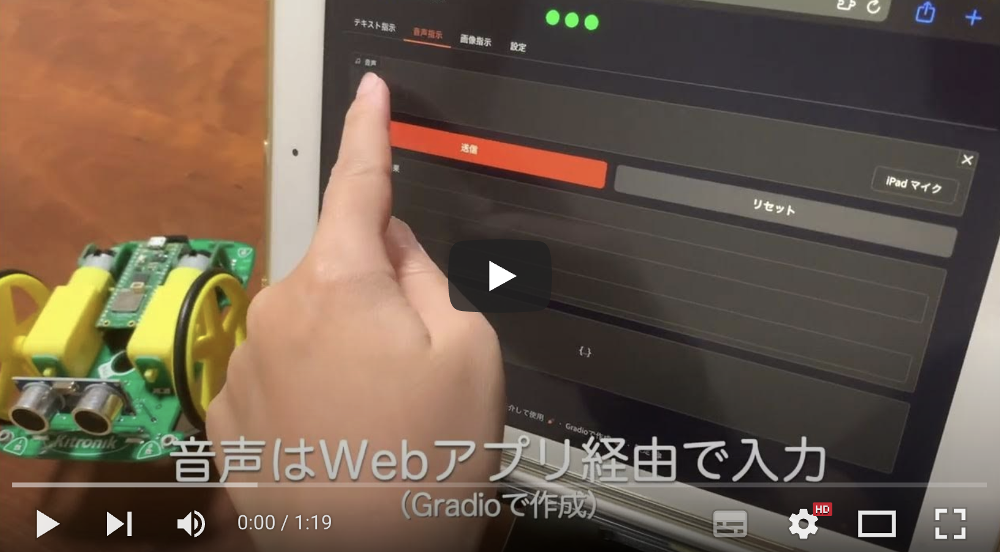
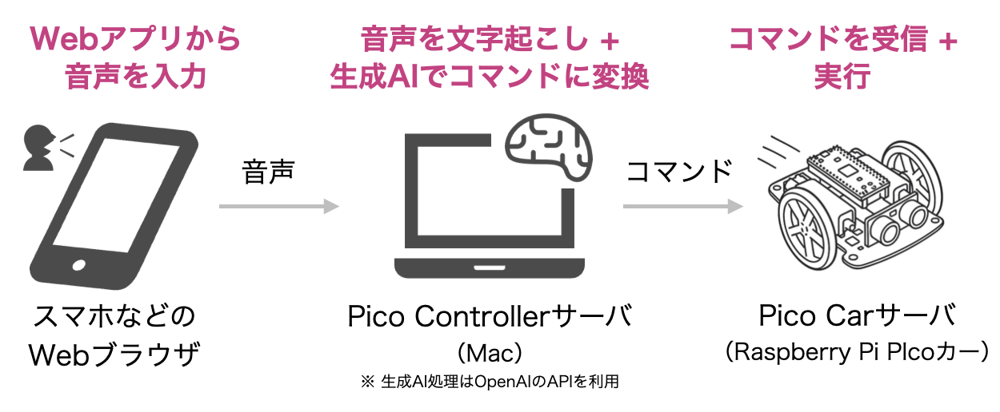
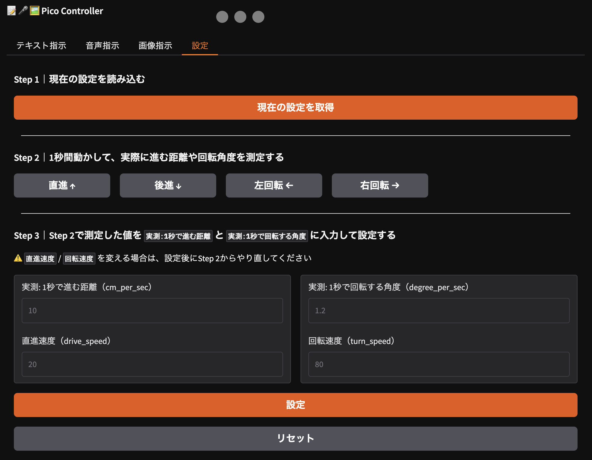

# LLM Pico Car

音声・画像・テキスト入力でRaspberry Pi Picoカーを動かすデモプロジェクトです。   
Gradioで作ったUIから自然言語や画像で指示を入力し、LangChainを使ってLLMで「前進」「右に曲がる」などのコマンドに変換して、Picoカーに送信します。

## デモ動画

- デモ動画（YouTube）: https://www.youtube.com/watch?v=glEbEZsswRA

<a href="https://www.youtube.com/watch?v=glEbEZsswRA">
  
</a>

## 発表資料

本プロジェクトに関するカンファレンス発表の一覧です。

| 日付 | イベント | 形式 | タイトル | 概要 | スライド | 動画 |
|------|-------|--------|-------|----------|--------|-------|
| 2025/12 | [PyLadiesCon 2025](https://2025.conference.pyladies.com/en/) | Talk | “Go Straight, Then Turn Right!”: How I Built a Voice-Controlled Toy Car Using Generative AI, Gradio, and Raspberry Pi Pico | [Abstract](https://2025.conference.pyladies.com/en/session/go-straight-then-turn-right-how-i-built-a-voice-controlled-toy-car-using-generative-ai-gradio-and-raspberry-pi-pico/) | [Slides](https://speakerdeck.com/komofr/pyladiescon2025-llmpicocar)(日本語/英語) | [Video](https://www.youtube.com/watch?v=EJajIBGRfD0)(日本語発表/英語字幕) |
| 2025/09 | [PyCon JP 2025](https://2025.pycon.jp/ja) | Poster | 「まっすぐ行って、右！」って言ってラズパイカーを動かしたい 〜生成AI × Raspberry Pi Pico × Gradioの試作メモ〜 | [Abstract](https://2025.pycon.jp/ja/timetable/talk/9CD3UW) | [Slides](https://speakerdeck.com/komofr/pyconjp2025-poster)(日本語) | - |

## 全体の構成



1. **Gradioで作ったWebアプリ:** ユーザが音声やルート画像を入力
2. **Pico Controllerサーバ（PC）:**  ユーザが入力した音声/画像をLangChainで「前進」「右折」などを意味するコマンドに変換し、Pico Carサーバに送信
3. **Pico Carサーバ（Raspberry Pi Pico）:**  Microdotを使ってHTTPサーバを動かし、Wi-Fi経由でコマンドを受信。コマンドに従ってPicoカーを動かす
    - 車体は市販のPicoカーキット + Raspberry Pi Pico WHを使用
        - 車体キット: [Kitronik Raspberry Pi Pico用 自走ロボットプラットフォーム（バギータイプ）](https://www.switch-science.com/products/8095?srsltid=AfmBOoq3LI2zKqSKydff-7FdRzAaHYW0sY-fLdm2LWPP5Xv9-Ityul-b)

## 構成

このプロジェクトは2つのサーバで構成されています。

| サーバ | 実行環境 | 役割 | コード | 
|----------------|----------|------|----|
| **💻 Pico Controllerサーバ** | PC (Python 3.13) | Gradio UIで入力を受け、コマンドをPico Carサーバへ送信 | `pico_controller` フォルダ配下 |
| **🚜 Pico Carサーバ** | Raspberry Pi Pico WH (MicroPython) <br> ※ Mockモードの場合はPC上でもCPythonで動作可 | コマンドを受け取り車体を制御 | `pico` フォルダ配下 |

Mockモードの場合は、両方ともPC上で動かせます。

## 動かし方

※ まだエラー処理が甘かったり、動作が不安定な箇所があります🙏

### 1. Mockモードで動かす（実機なしで確認）

**環境構築:**   
[環境構築](./docs/ja/setup.md)の「💻 Pico Controllerサーバの環境構築」の手順に従って環境構築をしてください。   
※ Mockモードの場合、Pico CarサーバとPico Controllerサーバは同じ環境上で動作します。

**起動手順:**
1. 下記コマンドで、Pico Carサーバを起動します。
```bash
python pico/main.py --mock
```

実行結果:
```
mock mode: True
✅ initialize_settings
```

2. 下記コマンドで、Pico Controllerサーバを起動します。

```bash
python pico_controller/app.py --mock
```

実行結果:
```
Loading Whisper model...
[config]
USE_MOCK=True
BASE_URL=http://localhost:5001/
* Running on local URL:  {ローカルURL}
* Running on public URL: {公開URL}

This share link expires in 1 week. For free permanent hosting and GPU upgrades, run `gradio deploy` from the terminal in the working directory to deploy to Hugging Face Spaces (https://huggingface.co/spaces)
```

3. `{ローカルURL}` または `{公開URL}` をブラウザで開くと、画面が表示されます。
※ 音声入力を使用する場合は、公開URLで開く必要があります。


### 2. 実機で動かす

**必要なハードウェア:**
- Kitronik社のPico用バギーキット（1個）
    - [Kitronik Raspberry Pi Pico用 自走ロボットプラットフォーム（バギータイプ） — スイッチサイエンス](https://www.switch-science.com/products/8095)
- Raspberry Pi Pico WH（1個）
    - [Raspberry Pi Pico WH — スイッチサイエンス](https://www.switch-science.com/products/8172?_pos=1&_sid=8a3e56a49&_ss=r)

**環境構築:**   
[環境構築](./docs/setup.md)の「💻 Pico Controllerサーバ」「🚜 Pico Carサーバの環境構築」の手順に従って環境構築をしてください。

**起動手順:**
1. Raspberry Pi Pico WHをKitronikのキットにセットし、乾電池を入れて起動します。
    - LEDが点灯している間は、起動中です（ネットワーク接続待ち）
    - ネットワーク接続に失敗した場合は、ビープ音を2回鳴らしてLEDが消えます
    - ネットワーク接続に成功し、セッティングが完了したら、成功音（ピコッという高めの音）を鳴らしてLEDが消えます
2. ネットワーク接続に成功したら、下記コマンドで疎通確認ができます。最後の行に `OK!` と出力されたら成功です。

疎通確認:
```
curl -v http://{settingsに設定したIPアドレス}:5001/health
```

3. PCにて、下記コマンドでPico Controllerサーバを起動します。

```bash
python pico_controller/app.py
```

4. 以降はMock版と同じです。

## キャリブレーション（速度と回転角の調整）
走らせる場所の状態やPicoカーの状態により、同じ速度設定でも進む距離や回る角度が変わります。
Pico Controllerの画面の設定タブで、速度や回転の度合いを調整できます。

**手順:**
1. Pico Controllerサーバを起動してブラウザで画面を開き、「設定」タブを開く
2. 「現在の設定を取得する」をクリックする
3. 「直進する」「後退する」をクリックし、現在の速度設定で1秒間Picoカーを動かす。このとき、 **1秒間に進む距離を計測する**
4. 3で計測した値を、 `実測: 1秒で進む距離（cm_per_sec）` に入力する
5. 同様に、「左回転」「右回転」をクリックし、現在の速度設定で1秒間Picoカーを回転させる。このとき、**1秒間に回転する角度を計測する**
6. 5で計測した値を、`実測: 1秒で回転する角度（degree_per_sec）` に入力する
7. 「設定」をクリックする
8. （必要に応じて実施） `直進速度（drive_speed）` / `回転速度（turn_speed）` をデフォルト値から変えたい場合は、0-100の値で入力し、「設定」をクリックする
    - 速度を変更した場合は、2. 以降の計測と設定を再度行うこと。


